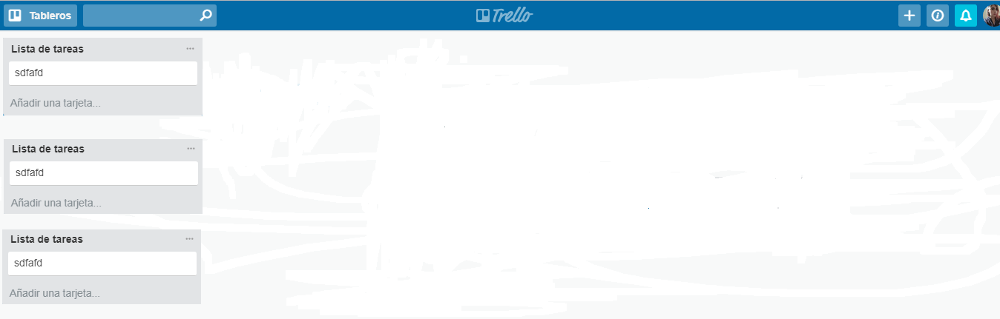

# Trello

In this challenge, we will replicate Trello's dashboard, for it we will follow the version flow that will guide you where to focus from the beggining.

As in the last challenge, you can use your own style or keep using the original one. Next you can see how it should be done:

## Versiones
1. version 0.0.1
2. version 0.0.2
3. version 0.0.3
4. version 0.0.4
5. version 0.0.5

Most of the elements where created in HTML from JS and design was given with CSS.

;

Version 0.0.1
Text "Añadir una lista.." will be shown. Once click is done text should be hidden and show a formulary. The formulary will be conformed by an input and a button so you can add tasks to your list.

Version 0.0.2
Clicking "Guardar" button a new box will be shown with the added list's name. It will "Añadir una tarea" text inside the list.

Version 0.0.3
Clicking "Añadir una tarea" should show a formulary with a textarea and a button that says "Añadir".

Version 0.0.4
Insert focus in the input by once "Agregar una tarea" is clicked. Once the "Añadir" button is clicked, the text should appear below the list's name.

Version 0.0.5
Show again the formulary below the last added list.
